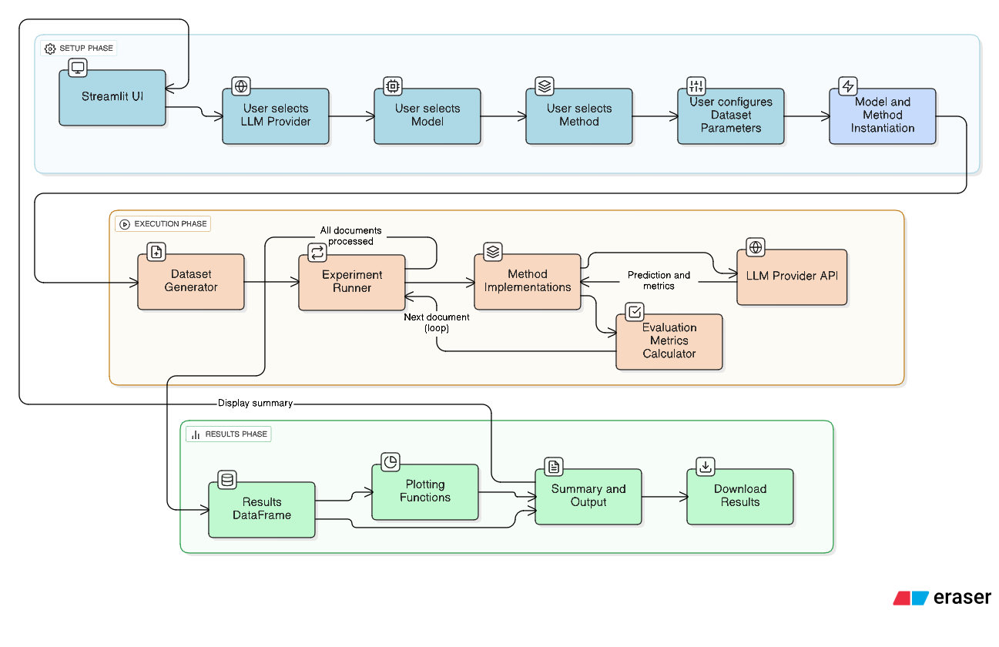

# Lost-in-the-Middle Analyzer

The **Lost-in-the-Middle Analyzer** is a lightweight benchmarking and visualization framework for analyzing long-context failures in large language models (LLMs). It provides synthetic datasets, evaluation metrics, and multiple retrieval/aggregation methods to study how models handle information distributed across large contexts.



## Features

* **Synthetic Dataset Generation**: Creates documents of configurable length with hidden answers at the start, middle, or end.
* **Multiple Evaluation Methods**:

  * **FullContext** – Pass the entire document to the model.
  * **SlidingWindow** – Divide the context into overlapping windows and aggregate predictions.
  * **RAG-BM25** – Retrieve top-k chunks using BM25 and query the LLM.
  * **Map-Reduce** – Chunk → answer each → aggregate via majority.
  * **Re-Ranking** – Retrieve with BM25 and re-rank top-k candidates.
  * **Query-Summarization** – Summarize chunks around the query before answering.
  * **Hybrid-RAG** – BM25 retrieval combined with summarization.
* **Model Support**:

  * Local dummy model (fast debugging).
  * [Ollama](https://ollama.ai/) for running local LLMs.
  * [Google Gemini API](https://ai.google.dev).
  * [OpenRouter](https://openrouter.ai) API for hosted models.
* **Evaluation Metrics**:

  * Exact-match accuracy.
  * Precision, recall, and F1 score.
  * BLEU score for string similarity.
* **Visualization**:

  * Accuracy by answer position (start/middle/end).
  * Accuracy as a function of context length.

## Project Structure

```
lost-middle-analyzer/
├── app.py                # Streamlit application entrypoint
├── core/
│   ├── evaluation.py     # Experiment runner, metrics, and plots
│   ├── generator.py      # Synthetic dataset generator
│   ├── models.py         # Model wrappers (dummy, Ollama, Gemini, OpenRouter)
│   └── methods/          # Implementations of supported methods
├── data/
│   └── sample_corpus.txt # Example placeholder dataset
├── test.py               # Utility for testing OpenRouter models
├── Dockerfile            # Container build file
├── requirements.txt      # Python dependencies
├── .env.example          # Example environment configuration
└── README.md             # Documentation
```

## Installation

### Prerequisites

* Python 3.11+
* [Streamlit](https://streamlit.io/) (installed via `requirements.txt`)
* API keys if using Gemini or OpenRouter

### Local Setup

```bash
# Clone repository
git clone https://github.com/your-org/lost-middle-analyzer.git
cd lost-middle-analyzer

# Setup virtual environment
python -m venv .venv
source .venv/bin/activate  # Linux/macOS
.venv\Scripts\activate     # Windows

# Install dependencies
pip install -r requirements.txt
```

## Running the Application

Start the Streamlit interface:

```bash
streamlit run app.py
```

Then open the URL provided in the terminal (default: `http://localhost:8501`).

## Environment Variables

Copy `.env.example` to `.env` and set your keys:

```env
GOOGLE_API_KEY=your-google-api-key
OPENROUTER_API_KEY=your-openrouter-api-key
```

## Usage

1. Select an **LLM provider** and model.
2. Choose a **retrieval/aggregation method**.
3. Configure dataset size, context length, and answer positions.
4. Run experiments and visualize results.
5. Optionally download raw results as JSON.

## Docker Deployment

Build and run with Docker:

```bash
docker build -t lost-middle-analyzer .
docker run -p 8080:8080 --env-file .env lost-middle-analyzer
```

Access the app at `http://localhost:8080`.

## Example Experiment

* **Provider**: Gemini API
* **Method**: RAG-BM25
* **Dataset**: 100 documents, 3000 tokens each
* **Positions**: start, middle, end

Results show accuracy drop when answers appear in the middle, highlighting the *lost-in-the-middle* effect.

## Contributing

Contributions are welcome. Please fork the repository, make your changes, and submit a pull request. For feature requests or issues, open a ticket in the [GitHub issue tracker](https://github.com/your-org/lost-middle-analyzer/issues).

## License

This project is released under the MIT License. See [LICENSE](LICENSE) for details.
